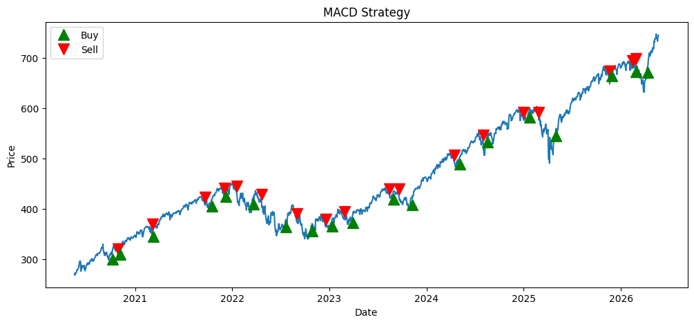
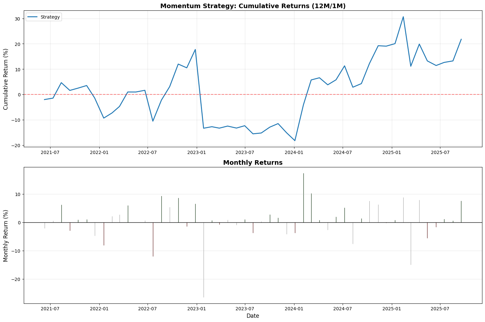

# Quant_Backtesting_Models

MACD: 

**Overarching Strategy:** The Moving Average Convergence Divergence (MACD) is a technical analysis tool that uses momentum to find opportunities to buy/sell. Academic Papers like Jegadesh & Titman (See Momentum Model Below) have proved that momentum still works and I wanted to extend this to see if MACD also produces returns. We are looking at the exponential moving average and whenever it flips from positive to negative we sell, and when it flips from negative sentiment to positive sentiment we buy.

**Findings:** This strategy does not seem reliable. Over certain periods it outperforms, other times underperforms. Over arbitrary timeframes within the past 20 years and looking at companies within the S&P500, it on average underperforms buy & hold strategies. We believe that this is because it spends the majority of time not within a position, causing underperformance to buy & hold.It also underperforms in non-US markets (Europe, China, Japan) were tested.

**Some Assumptions that are made: **

1. Buying and Selling are cut off such that they are 1:1 to not deal with the implications of Shorting & costs.  
2. Starting with 10,000 of capital, on a buy signal you will buy as much as you can and sell everything.

TODO/Additional Considerations
1. Adjusting the buy signal based on duration/intensity of switches
2. Trading costs are not incorporated
3. I assume we can easily short stocks without problem, and that the eventual buy pair cancels out the short leg.
4. How does this strategy perform during times of intense volatility?

## Jegadeesh-Titman (1993) Cross-Sectional Momentum

**Strategy:** Cross-sectional momentum across the full S&P 500 universe. 
Ranks all stocks by 12-month trailing return, goes long top 50 and 
short bottom 50, rebalanced monthly with overlapping portfolios — 
a direct implementation of the Jegadeesh & Titman (1993) paper.

**Key Metrics (2010–2025):**
- Annualized Return: 7.59%
- Annualized Volatility: 23.56%
- Annualized Sharpe: 0.32
- S&P 500 Sharpe (same period): ~0.90

**Findings:** Strategy produces positive but modest returns, 
underperforming the S&P 500 on a risk-adjusted basis. Consistent 
with academic literature on momentum decay in crowded strategies 
post-2010.
